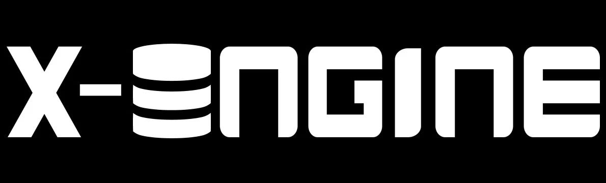
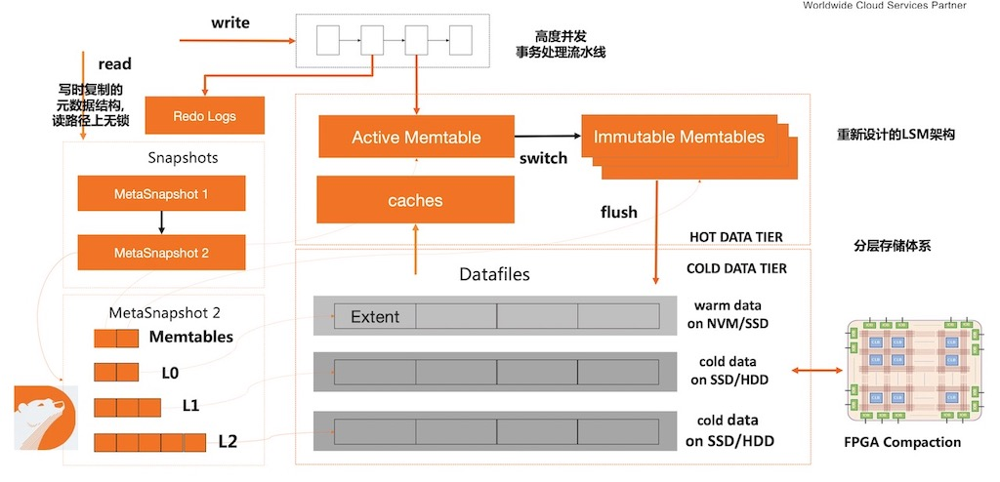

# X-Engine Introduction

## 1.X-Engine是什么
X-Engine是一个基于LSM-tree架构开发的MySQL事务存储引擎，由阿里云数据库产品事业部PolarDB新型存储引擎团队开发维护。 
目前X-Engine在阿里公共云平台上以两种产品形态对外提供售卖：
 + [RDS MySQL X-Engine](https://help.aliyun.com/document_detail/148660.html)，该形态以单机MySQL 存储引擎的方式提供服务。
 + [PolarDB MySQL X-Engine](https://help.aliyun.com/document_detail/195661.html)，该形态以X-Engine一写多读的方式提供服务。

开源版本X-Engine在代码上，与我们RDS MySQL X-Engine产品的代码完全相同。而一写多读版本考虑到线下部署时依赖较多，本次暂未开放源代码。 

## 2.为什么做X-Engine
X-Engine的初衷是想创造一个更好的事务存储引擎，以替代当时在阿里内部业务中被广泛使用的InnoDB引擎。 业务层面，在2016年前后的时间节点，阿里的业务流量在飞速增长，以当时的流量增速趋势，通过在MySQL InnoDB上打patch的小打小闹方式终将难以为继。 
技术层面，MySQL官方不可能只为了阿里巴巴的业务需求而定制开发计划，而内核研发团队在InnoDB引擎20W行代码的基础上魔改的代价也过于高昂。 

最后的结论是另选一条更合适的技术路线来解决当时的业务问题。最终，我们选择了当时学术界和工业界均有一定研究和积累的的LSM-tree技术架构。

## 3.X-Engine与RocksDB的关系
X-Engine的第一个版本的代码源自RocksDB 4.8.1（2016年7月发布）,所以它并不是从第一行代码开始完全重新开发。  
选择基于RocksDB的代码作为基础向前演进，符合当时团队的工程能力现状， 有一个优秀的蓝本作为参照，我们可以在索引/空间管理/高性能索引/高性能事务处理框架的多个技术方向上,同时开展探索和研究，而不用担心大家各自开发的功能长久不能组装在一起运行。另一方面我们可以复用MyRocks接口将X-Engine适配到MySQL运行，如此团队可以将精力专注在存储引擎核心的能力优化上 
X-Engine自2016年之后即开始完全独立演进，截至目前近6年的时间里，绝大部分核心模块均已经被重写，目前除了在存储引擎接口上与RocksDB官方保持一致外，大部分模块的设计理念与RocksDB均都有较大不同。开源之前的代码合规扫描结果显示70%均为自研代码。 
 

## 4. X-Engine的技术
 X-Engine引擎的详细介绍可参见[X-Engine技术介绍](https://help.aliyun.com/document_detail/148660.html)，X-Engine技术点简要总结：
  - 典型的LSM-tree架构，分为内存中的增量修改部分，以及磁盘上的全量数据部分。
  - 写入采用异步事务流水线技术，避免了事务处理过程中的大量同步操作，具有较高的写吞吐。
  - Compaction以Extent/Page为单位，因此可以以小Task的方式高度并发并降低对前台的影响。compaction支持Extent/Page粒度的数据复用，避免数据搬迁和拷贝。
  - 磁盘上的数据常态只有两层(L1热层和L2冷层),层数少的目的是为了更好的读性能。磁盘文件以FILE(1GB)/Extent(2MB)/Page(16KB)的粒度管理，数据默认压缩存储(3~5倍压缩率),空间可自动扩张收缩。
  - 精细化的冷热数据管理，支持flush/compaction之后的主动cache预热，支持按冷热特征进行compaction调度。
  - 与MySQL体系无缝融合, 支持中文字符集,支持Online/Instant/Paralle DDL，支持xtrabackup物理备份。
 
 
 
 ### 4.1 作为MySQL的存储引擎
X-Engine在阿里内部主要作为MySQL的存储引擎使用，因此我们在MySQL生态下做了大量工作以满足各类型业务的需求.  大部分情况下X-Engine可以作为InnoDB引擎的一个直接替代，并获得3~5倍的存储空间节省,二者的不同可参见[X-Engine与InnoDB的差异](https://help.aliyun.com/document_detail/148404.html)。

- X-Engine 支持MySQL 5.7/8.0版本，开源的为8.0版本也是目前内部主要使用的版本,5.7版本已经停止迭代演进。
- 支持[Instant DDL](https://mp.weixin.qq.com/s?__biz=MzU0NDcwNjQxNA==&mid=2247483761&idx=1&sn=17d603f1b1efd882a779af499a086b25&chksm=fb795b70cc0ed2663b51d853d647ea94f38b73ac06f67388923797fcc1e02f0e1eb14b8b8610&token=992153913&lang=zh_CN#rd)/[Online DDL](https://mp.weixin.qq.com/s?__biz=MzU0NDcwNjQxNA==&mid=2247483788&idx=1&sn=f40bf559d8ce8595a63901a788214946&chksm=fb795b8dcc0ed29ba77b0701a7a9e5684f38d7a0a9fd5aff6f767b280790c3e9c00b060780fc&token=992153913&lang=zh_CN#rd)/[Parallel DDL](https://mp.weixin.qq.com/s?__biz=MzU0NDcwNjQxNA==&mid=2247484013&idx=1&sn=2b9c9c6cb1fe7e7f9bb4bb714bf9a175&chksm=fb79586ccc0ed17a6feaf44589ccfc41ffcbb81481ebb48d0fb1b0882e3849680fe4d79890a4&token=992153913&lang=zh_CN#rd)等DDL优化，提升大表做schema变更时的用户体验。
- 支持完善的统计信息管理，包含表信息(表数据量，表记录数，平均行长)，索引信息(索引大小，索引key长度)和索引列分布信息(NDV)等，以辅助优化器选出最优的执行计划。
- 支持通过xtrabackup进行物理备份恢复(此功能此次暂未开源)
- 多种字符集支持，如中文GBK/UTF8MB4等。
 
 ### 4.2 事务系统及索引设计
- LSM-tree引擎的事务提交流程是事务操作中最重的一个步骤，X-Engine通过将事务提交流程拆解为不同的小阶段，并使用pipline方法进行调度，结合异步提交以及线程解耦，实现了极高的写入吞吐。在KV接口下结合AsyncCommit，可以达到超过200万每秒的write ops。
- X-Engine在RocksDB的SkipList之外，提供了一个变种ART索引作为内存表的默认索引，其在全内存场景下具有更好的Point/Range读写性能，
- LSM-tree由于其内存表的结构特征，相比InnoDB引擎可能积攒更多的待checkpoint的WAL日志（这个问题在各个表读写不均衡时情况更为明显），为了提升崩溃恢复时的系统启动速度，X-Engine支持在Crash Recovery时并行的回放WAL日志。[X-Engine并行崩溃回复](https://mp.weixin.qq.com/s?__biz=MzU0NDcwNjQxNA==&mid=2247484073&idx=1&sn=8e417cfb5da8cc04b661bfd7772b08ef&chksm=fb7958a8cc0ed1be1e93dcc58320434fb3b5d984571c17ae5f9414aad0a1ab029f252d51d601&token=992153913&lang=zh_CN#rd)
- 与RocksDB等写入触发Memtable的Switch和刷盘不同，X-Engine支持在系统空闲时，将内存表刷盘并做checkpoint。
 ### 4.3 LSM-tree层次结构及Compaction系统
X-Engine对比Rocksdb，更偏向读优化，因此它具有更浅的层次结构,而其整个compaction系统的设计均面向这个浅层次的LSM-tree架构做优化。
- X-Engine磁盘数据部分包含持久化的L1和L2，以及零时存在的L0层。其设计理念是：L2层为全量冷数据，L1层为被频繁读写的热点数据。而L0层是在compaction来不及时，暂存内存表转储的数据。在系统负载较低时，L0会直接与L1层合并落盘。
- 由于数据按2MB的Extent粒度存储，L1层的数据与L2层的compaction可以基于读写频次触发的调度策略。这样可以让热点数据尽量保留在L1层，提升读盘时的IO效率。相关技术可见[X-Engine如何精准的冷热分离](https://mp.weixin.qq.com/s?__biz=MzU0NDcwNjQxNA==&mid=2247483977&idx=1&sn=3da92a85a20e4c18c7dd9365aa3469bf&chksm=fb795848cc0ed15e23fe9ad95a126aaab590463bb78fe17fa912437d804688c631b8063baf11&token=992153913&lang=zh_CN#rd)
- X-Engine的compaction是我们投入了最大精力去研究的一个自技术方向：
  - Compaction支持数据复用，在大部分真实业务场景，数据复用可以极大的降低IO和计算资源的消耗
  - 对比Rocksdb，X-Engine的compaction是支持单Task内部并行的，具有更细的粒度，可以提升任务并行度。
  - X-Engine支持闲时compaction任务调度，即在系统负载较低时会全力触发compaction，将LSM-tree调整到最优状态。
  - 为了更进一步优化Compaction的性能，我们甚至尝试过使用FPGA进行加速,[X-Engine FPGA加速](https://www.usenix.org/system/files/fast20-zhang_teng.pdf)
  - 
### 4.4 缓存系统
 - X-Engine的缓存系统由三个层次组成,Memtable/RowCache/BlockCache。其中Memtable包含最近写入的数据，RowCache一般配置5%左右的内存，采用哈希索引对点查进行加速，BlockCache则缓存磁盘上的Page级别数据。
 - LSM-tree由于其架构特点，在Memtable刷盘或者Compaction时，会触发版本变更导致的Cache主动失效，此过程会导致性能的抖动。X-Engine支持在Memtable刷盘以及Compaction之后，根据内存数据的访问统计，进行主动的Cache回填，尽最大可能降低Cache抖动。
 - 更进一步的我们甚至尝试过使用机器学习的方法，对LSM-tree中的数据进行Cache Prefetch。以期待完全消除Cache Miss的影响。详细介绍见论文[Learned Prefetcher For X-Engine]()
 - X-Engine的磁盘(L0/L1/L2）元数据管理更多的面向内存访问速度进行优化，以提升读取路径中的CPU效率。详细介绍建[X-Engine的内存读优化](https://mp.weixin.qq.com/s?__biz=MzU0NDcwNjQxNA==&mid=2247483951&idx=1&sn=e09e3c693f08e8962df1d64d41502a78&chksm=fb79582ecc0ed138e876ade3b5d87c52ee114fdd38fdec79c938bdb2230b6957e98b5d1ec4b4&token=992153913&lang=zh_CN#rd)
### 4.5 存储空间管理
X-Engine的磁盘空间管理的目标，是更便于Compaction的数据复用以及更低的存储空间消耗
- X-Engine的数据分散在最大为1GB大小的多个数据文件中，所有的数据文件按2MB大小切割为Extent，Extent是空间分配的基本单位。Extent会再切分为不同的Page，Page为不定长，所有的Page均默认压缩存储。通常情况下相对InnoDB,X-Engine可以获得3~5倍的存储空间优势。
- X-Engine的存储空间支持自动扩张和收缩。即在一个表中大量数据被删除时，X-Engine的存储空间会自动回收，而不会像InnoDB那样需要执行Optimize命令才能回收空间。
 

关于X-Engine空间管理可以见详细介绍文章: [X-Engine是如何省成本的](https://mp.weixin.qq.com/s?__biz=MzU0NDcwNjQxNA==&mid=2247484064&idx=1&sn=39aa39bfb3849291165785bed091f241&chksm=fb7958a1cc0ed1b7fb6ab107ab17325ca8daed75a34dfbcbc9ce1fb48e274a85e6bdb2a179c3&token=992153913&lang=zh_CN#rd)

### 4.6 可运维性
- 完善的Information_schema表，包含内部各组件的内存消耗分布，每张表的磁盘空间消耗，后台任务(compaction/flush/空间回收)运行状态统计等。
- QueryTrace功能，可以将一条SQL在运行过程中的每个阶段的耗时分布详细记录下来，包括加锁解锁时间/加锁解锁次数/IO读写次数/IO耗时。此工具可以辅助快速定位慢查询的瓶颈点。

### 4.7 存储计算分离及一写多读
在基础设施云化的背景下，存储计算分离是一个趋势。X-Engine结合底层分布式存储可以解决高可用/存储空间管理/备份等难题，同时可以方便快捷的扩展只读节点，满足业务对读性能扩展的诉求。目前基于X-Engine一写多读技术打造的产品PolarDB 历史库已经上线，后续会有专门的文章解读其技术实现细节。
 
## 5. X-Engine上的研究成果
PolarDB X-Engine团队除了解决阿里巴巴集团内部和阿里云上出现的技术挑战，也在LSM-tree领域的技术前沿上做了很多的探索和尝试。 
我们探索的方向包括新型存储器件/新型定制计算硬件/AI for DB等领域。 
团队已发表的论文如下：
 - SIGMOD'19 [X-Engine: An Optimized Storage Engine for Large-scale E-Commerce Transaction Processing](https://www.cs.utah.edu/~lifeifei/papers/sigmod-xengine.pdf)
 - VLDB'19 [LB+-Trees: Optimizing Persistent Index Performance on 3DXPoint Memory](https://dl.acm.org/doi/abs/10.14778/3384345.3384355)
 - FAST'20 [FPGA-Accelerated Compactions for LSM-based Key-Value Store](https://www.usenix.org/system/files/fast20-zhang_teng.pdf)
 - VLDB'20 [Leaper: a learned prefetcher for cache invalidation in LSM-tree based storage engines](http://www.cs.utah.edu/~lifeifei/papers/leaper-talk.pdf)
 - VLDB'21 [Revisiting the Design of LSMtree Based OLTP Storage Engine with Persistent Memory](https://dl.acm.org/doi/abs/10.14778/3467861.3467875)
          
## 6.写在最后

存储基础技术是一个需要长期耕耘积累的方向,X-Engine团队前后6年的努力，才取得上述些许进展和成果。 
在此过程中我们深刻认识到，开发一个功能完备性能优异的存储引擎的难度以及所需要的时间。未来我们会在LSM-tree存储引擎方向上继续探索和研究，欢迎也志同道合的伙伴加入我们。 
<!--以下为X-Engine开源技术交流群的二位码。-->
 <!--  -->